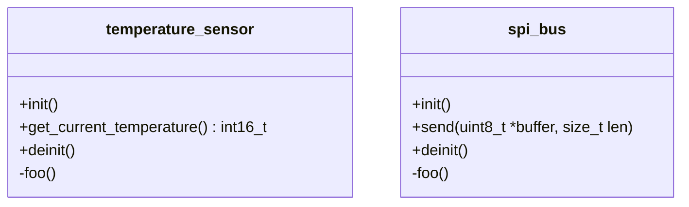

# 2-modularity

Step by step example to show how to achieve modularity in C.

Let's say these are the modules I want to implement.



## Steps

### Base

#### What we did

```sh
$ gcc main.c spi_bus.c temperature_sensor.c
```

### Fixed base

#### Problems of the previous version

* Linker error: multiple definition

#### Takeaways

* Identifiers with external linkage must be unique in the whole program (i.e. among all the translation units). See C99, Paragraph 6.2.2.2.
* Naming convention (e.g. using prefix) is the only solution to avoid conflicts of identifiers with external linkage

## Takeaways

### Misc

* Use of fixed width integer types from `stdint.h` (since C99) for better portability. See more on [cppreference](https://en.cppreference.com/w/c/types/integer).
