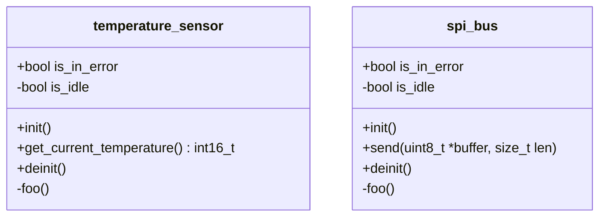

# 2-modularity

Step by step example to show how to achieve modularity in C.

Let's say these are the modules I want to implement.

```mermaid
classDiagram
  class temperature_sensor
      temperature_sensor : +init()
      temperature_sensor : +get_current_temperature() int16_t
      temperature_sensor : +deinit()
      temperature_sensor : -foo()
      temperature_sensor : +bool is_in_error
      temperature_sensor : -bool is_idle

  class spi_bus
      spi_bus : +init()
      spi_bus : +send(uint8_t *buffer, size_t len)
      spi_bus : +deinit()
      spi_bus : -foo()
      spi_bus : +bool is_in_error
      spi_bus : -bool is_idle
```

## Steps
