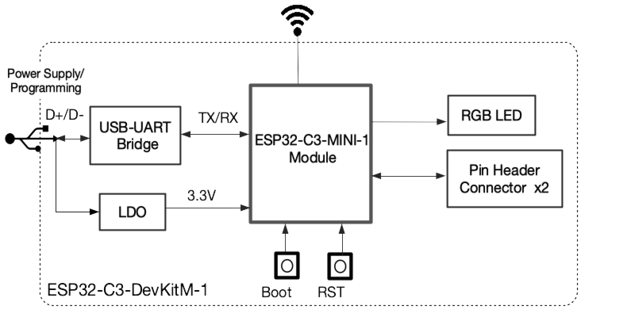

## What I know about you...

* Most of you know C.
* All of you come from a CS bachelor.
* Your bachelor's curriculum:
    * Computer Programming
    * Operating Systems
    * Computer Systems Architecture
    * Computer Networks

## Some more information about you

A quick round of show of hands. Who of you:

::: incremental
* has built a medium sized C/C++ project ?
* has familiarity with C/C++ compilers and linkers (e.g. in terms of relevant flags to pass to control compilation)?
* has ever written Makefiles and/or used CMake?
* has ever heard of/performed cross-compilation?
* has ever programmed bare-metal firmwares?
* has ever heard/used of RTOS?
:::

## So...

```cpp
if (you_already_know_everything) {
    say("Well, I hope you enjoy the project.\n");
} else {
    say("Luckily for me, you leave to me something to"
        "tell and show.\n");
}

```

## Overall plan of this part of the course

* Some details about the C/C++ programming.
* Use of build systems to setup relatively big C/C++ projects
* Common architectures and design patterns of embedded firmwares
* How to test embedded firmwares
* How to debug embedded firmwares

## What's special about embedded programming? [@whiteMakingEmbeddedSystems2012, chapter 1]

* Embedded programming is still programming...
* ...with these peculiarities:
    * Low-level (bare metal)
        * Deal with interrupts and memory-mapped IO
    * Fight with resource limitations
        * Energy, Flash, RAM, CPU
    * Execution happens on the *target*
        * Need cross compiling, flashing
        * Debugging and testing is harder
        * Often *host* is used to refer to the development machine, e.g. your laptop.

# Plan of today: a tour until Hello World

## Where to find the documentation

* [ESP32-C3 SDK main page: https://docs.espressif.com/projects/esp-idf/en/v4.4/esp32c3/get-started/index.html](https://docs.espressif.com/projects/esp-idf/en/v4.4/esp32c3/get-started/index.html)
* [User guide of the "stuff" we've just given you: https://docs.espressif.com/projects/esp-idf/en/v4.4/esp32c3/hw-reference/esp32c3/user-guide-devkitm-1.html](https://docs.espressif.com/projects/esp-idf/en/v4.4/esp32c3/hw-reference/esp32c3/user-guide-devkitm-1.html)

## What is the "stuff"?

:::::::::::::: {.columns}
::: {.column width="60%"}
* MCU (Microcontroller)
    * A single IC (Integrated Circuit) that has: processor core + memory + peripherals 
* SoC (System on Chip)
    * Often used interchangeably with MCU
    * Some people use SoC to refer to an IC that integrates a MCU as well as many other comoponents (GPU, Connectivity modules, etc.).
        * E.g. Qualcomm's Snapdragon SoCs
* Development Board
    * A PCB (printed circuit board) with a MCU/SoC and ancillary components (Clocks, LEDs, push-buttons, programmer, USB-to-UART, etc.) 

:::
::: {.column width="40%"}



:::
::::::::::::::

## When to search what? {.allowframebreaks}

* [ESP32-C3-DevKitM-1](https://docs.espressif.com/projects/esp-idf/en/latest/esp32c3/hw-reference/esp32c3/user-guide-devkitm-1.html)
* Let's see some other boards:
    * [STM32F0Discovery](https://www.st.com/en/evaluation-tools/stm32f0discovery.html)
    * [Arduino Uno Rev3](https://store-usa.arduino.cc/products/arduino-uno-rev3/)
\framebreak
* Gists:
    * Processor core reference manual
        * I need to understand this piece of assembly
        * I need to write a piece of assembly
        * I need to understand how interrupts work on the current architecture
    * MCU/SoC reference manual
        * The vendor's SDK has some bugs...
        * The vendor's SDK sucks. I want to implement by own SDK
    * MCU/SoC datasheet
        * Do I have peripheral X? Which are the characteristics?
        * Check the pinout. On which pin do I have this functionality?
    * Development board user guide
        * I need to know which pin I should raise to light the on-board LED
        * I need to know whether there is an on-board programmer and how can I use it.

## Let's say hello to the world

* Follow the [Get Started](https://docs.espressif.com/projects/esp-idf/en/v4.4/esp32c3/get-started/index.html#introduction) page.

## Flashing: how it works?

* JTAG (Joint Test Action Group)
* SWD (Serial Wire Debug)
    * ARM specific
* In our case flashing is done via UART. For more information:
    * [First stage bootloader](https://docs.espressif.com/projects/esp-idf/en/v4.4/esp32c3/api-guides/startup.html#first-stage-bootloader)
    * [Esptool documentation](https://docs.espressif.com/projects/esptool/en/latest/esp32c3/index.html)
        * In particular [Boot mode selection](https://docs.espressif.com/projects/esptool/en/latest/esp32c3/advanced-topics/boot-mode-selection.html#boot-mode-selection)
